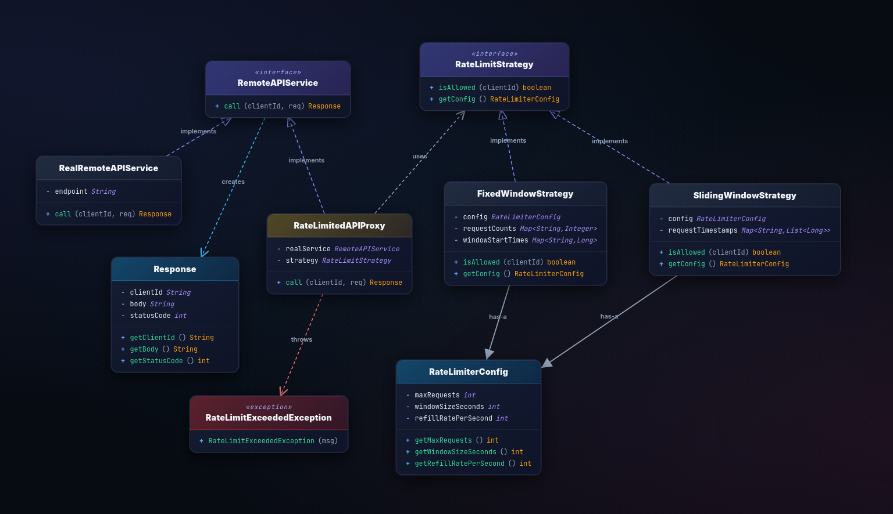

# Rate Limiter — Low-Level Design (Java)

A clean Java implementation of the **Proxy design pattern** combined with the **Strategy pattern** to enforce per-client API rate limiting. Two rate-limiting algorithms are provided: **Fixed Window** and **Sliding Window**.

---

## UML design



## How to Run

### Prerequisites

- **Java 11+** installed (`java -version` to verify)

### Compile

From the project root (`Rate Limiter/`):

```bash
javac $(find . -name "*.java")
```

### Run

```bash
java com.ratelimiter.Main
```

### Expected Output

```
=== FixedWindowStrategy ===
Call 1 succeeded: OK from https://api.example.com
Call 2 succeeded: OK from https://api.example.com
Call 3 succeeded: OK from https://api.example.com
Call 4 blocked: Rate limit exceeded for client client-A. Try again later. Status: 429
Call 5 blocked: Rate limit exceeded for client client-A. Try again later. Status: 429

=== SlidingWindowStrategy ===
... (same pattern)

=== Two clients, FixedWindow ===
Call 1 (client-A) succeeded: ...
Call 2 (client-B) succeeded: ...
Call 3 (client-A) succeeded: ...
Call 4 (client-B) succeeded: ...
Call 5 (client-A) blocked: ...   ← A exhausted, B unaffected
Call 6 (client-B) blocked: ...
```

---
